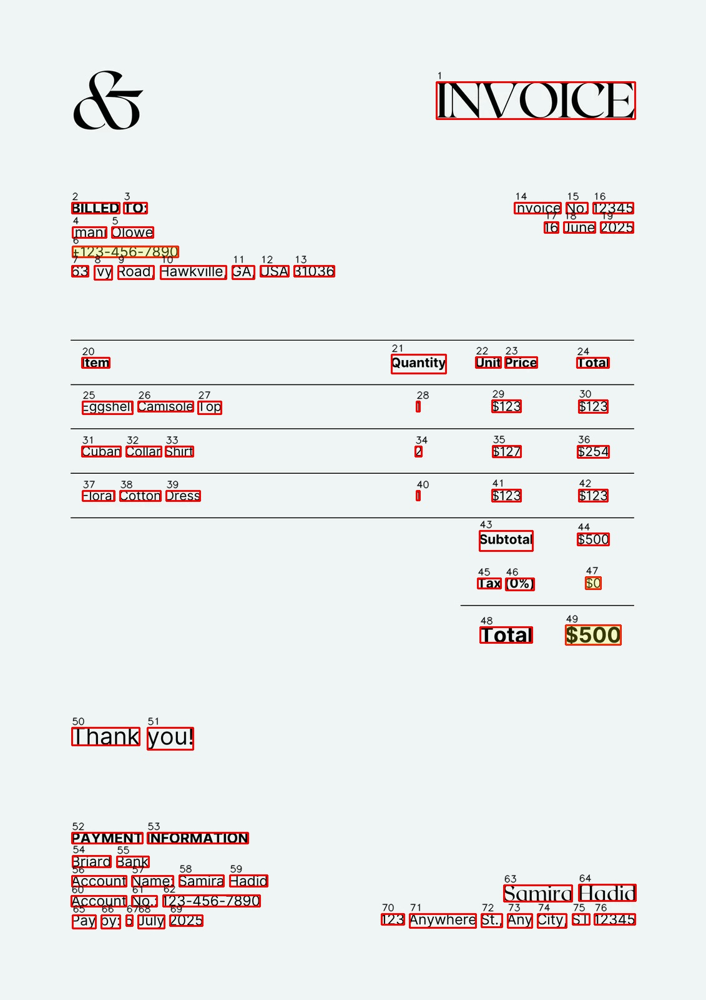
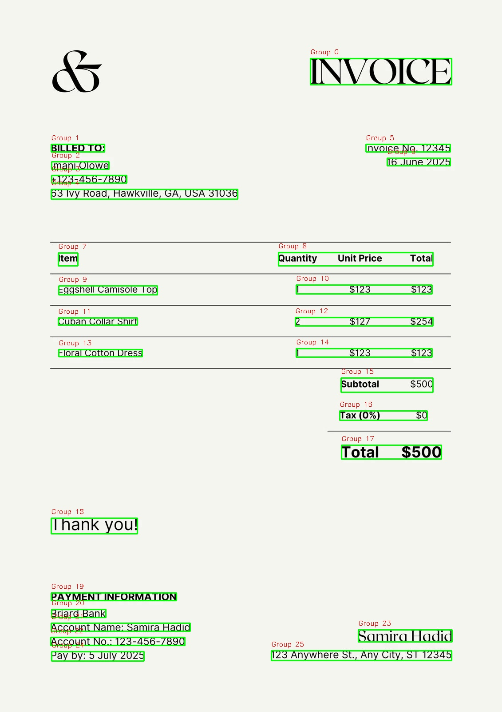
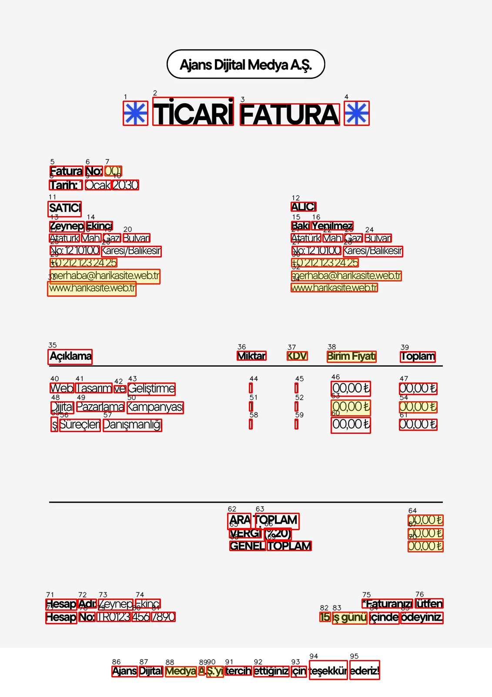
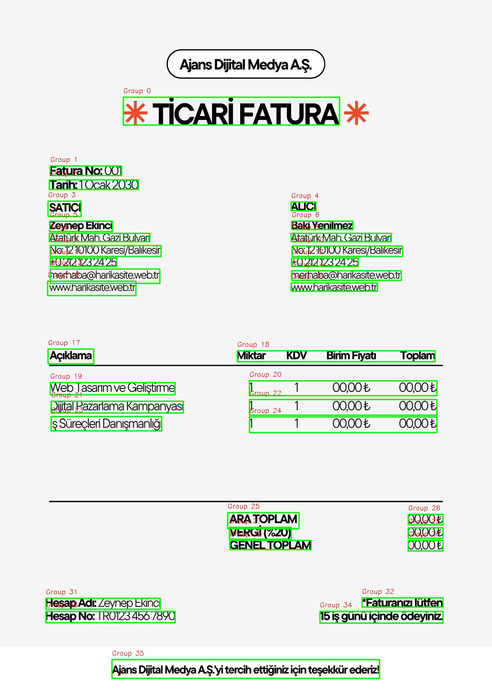

# OCR-Invoice: Data Extraction & Analysis

This project demonstrates how OCR (Optical Character Recognition) can be used to extract structured and meaningful data from unstructured invoice images using Tesseract. It highlights the impact of preprocessing, grouping logic, and post-processing techniques to significantly improve the quality and usability of OCR results.

🔍 **[Jump to code](./advanced_ocr.py)** ⬅️

## 📷 Before & After

| **Before (Raw OCR)** | **After (Structured OCR)** |
|----------------------|-----------------------------|
|  |  |
|  |  |

> *Notice how the raw output produces fragmented, hard-to-use data, while the structured version groups related text and extracts actionable invoice values.*

**[View Advanced OCR Logic](./advanced_ocr.py)** ⬅️

---

## 📌 Features

### ✅ Standard OCR (Baseline)
- Raw OCR with Tesseract using `pytesseract`
- Annotated invoice images with confidence levels
- Red boxes for words, yellow highlights for low-confidence text
- Word ID overlay for easier debugging
- Extracts total amount via regex
- Outputs a `.json` file containing:
  - Readability status
  - Average confidence
  - Words with positions and confidence
  - Sample extracted text

### 🚀 Advanced OCR + Data Structuring
- Groups words into visual rows using bounding box logic
- Detects and extracts numeric amounts associated with keywords (e.g., `toplam`, `vergi`, `ödenecek tutar`)
- Aggregates and cleans OCR results into structured Excel sheets
- Saves annotated images with bounding boxes for each group
- Uses confidence thresholds to evaluate OCR quality
- Fully automates the data pipeline for bulk invoice processing

---

### 📌 Conclusion

This project demonstrates a significant leap in document intelligence by enhancing OCR outputs through geometric analysis and layout-aware grouping. Traditional OCR tools often produce fragmented results that lack contextual structure, making downstream data extraction and analysis difficult. By introducing a spatial proximity-based pipeline, this solution not only improves data cleanliness and consistency but also enables scalable and interpretable invoice processing.

The visual difference between the raw and structured output isn't just aesthetic — it represents a transition from unstructured noise to actionable insight. Each invoice is processed with improved semantic understanding, ensuring that critical financial data like totals, taxes, and line items are accurately identified and grouped together.

Beyond technical gains, this approach lays a foundation for broader automation in business environments, such as accounting software, audit workflows, and enterprise resource planning (ERP) systems. By turning OCR noise into structured, high-confidence datasets, this work bridges the gap between raw document scans and meaningful business intelligence.

